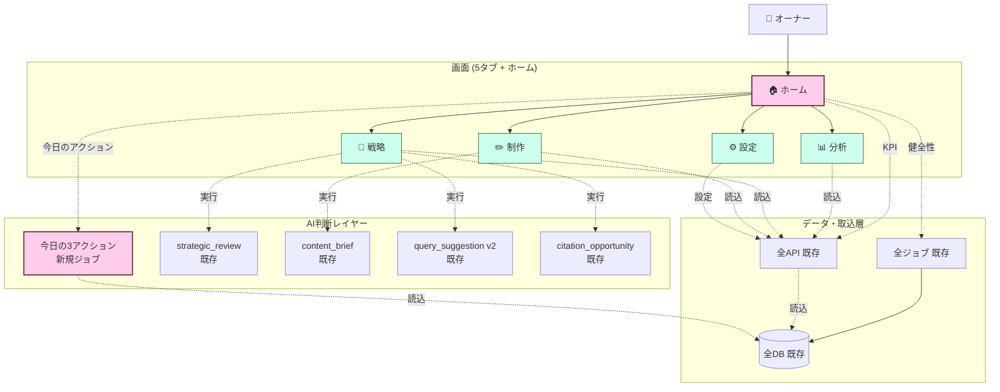

# 機能拡張計画書: UX 再設計 — 5タブ集約 + ホーム新設

最終更新: 2026-05-06
ステータス: ドラフト(承認待ち)
関連: `docs/feature_keyword_universe_plan.md` の後継 — Keyword Universe を含む既存全機能を**ユーザーが使いやすい形に再構成する**ためのリデザイン

---

## 0. 背景

`feat/keyword-universe` ブランチで Phase 1〜5 を完了したが、フロントエンドの構造は機能追加のたびにナビゲーションを増やしてきた結果、**10 タブが横並びの「機能カタログ」**状態になっている。

オーナーからの指摘:

- **どこを見ればよいかわからない**
- **入力する場所が分散していてわかりづらい**
- **データソース(API/スクレイプ/AI)の区別が画面から読み取れない**
- **どの数値を信じてよいか、どの順で操作すべきかが不明**

機能不足ではなく **構造化不足** が問題。本計画は **既存機能を壊さずに、UI を統合して認知負荷を下げる** ことに集中する。

ゴール: **オーナーが毎朝 1 画面(ホーム)を開けば、その日にやるべきことが 30 秒でわかる** 状態にする。

---

## 1. 現状システムの整理

### 1.1 データ取得手段の分類

| 種別 | 機能 | エンドポイント / 認証 | 頻度 |
|---|---|---|---|
| 🔌 公式API | GSC収集 | Google Search Console API / OAuth2 | 毎日 3:00 |
| 🔌 公式API | GA4収集 | Google Analytics Data API / OAuth2 | 毎日 3:30 |
| 🔌 公式API | PageSpeed | PSI v5 / API Key | 毎日 5:30 |
| 🔌 公式API | WordPress | WP REST / App Password | オンデマンド |
| 🔌 公式API | Resend | Resend API / API Key | アラート時 |
| 🤖 LLM API | citation_monitor | Gemini / Perplexity / AIO | 毎日 4:00 |
| 🤖 LLM API | strategic_review | Gemini | 月次手動 |
| 🤖 LLM API | weekly_summary | Gemini | 月曜 6:00 |
| 🤖 LLM API | monthly_report | Gemini | 毎月 3 日 7:00 |
| 🤖 LLM API | theme_suggestion | Gemini | オンデマンド |
| 🤖 LLM API | query_suggestion v2 | Gemini | オンデマンド |
| 🤖 LLM API | content_brief | Gemini | オンデマンド |
| 🤖 LLM API | content_draft | Gemini | オンデマンド |
| 🤖 LLM API | citation_opportunity | Gemini | オンデマンド |
| 🤖 LLM API | eeat_analysis | Gemini | オンデマンド |
| 🤖 LLM API | inquiry_structuring | Gemini | webhook 起動 |
| 🤖 LLM API | compliance_check | Gemini | 記事ドラフト時 |
| 🕷️ スクレイプ | Googleサジェスト | suggestqueries.google.com | 月曜 4:30 |
| 🕷️ スクレイプ | Bingサジェスト | api.bing.com/osjson.aspx | 月曜 4:30 |
| 🕷️ スクレイプ | 競合RSS | 各競合の /feed/ | 毎日 5:00 |
| 🕷️ スクレイプ | 競合見出し | 各競合のトップ + target_urls | 月初 1日 4:45 |
| 🪝 Webhook | 問合せ受信 | /webhook/inquiry | リアルタイム |
| ✋ 手入力 | business_context | 設定→事業情報 | 任意 |
| ✋ 手入力 | target_queries | クエリページ | 任意 |
| ✋ 手入力 | competitors | 設定→競合 | 任意 |
| ✋ 手入力 | author_profiles | 設定→著者 | 任意 |
| ✋ 手入力 | citation_manual | 手入力ページ | 任意 |
| ✋ 手入力 | credentials | 設定→認証 | 初回 |

### 1.2 現状の構成図

```mermaid
flowchart LR
    subgraph 外部["外部"]
        EXT_API[公式API群<br>GSC/GA4/PSI/WP/Resend]
        EXT_AI[LLM API群<br>Gemini/Perplexity/AIO]
        EXT_SC[スクレイプ対象<br>Suggest/競合HTML]
    end

    subgraph 取込["Scheduler / Worker"]
        J1[GSC毎日3:00]
        J2[GA4毎日3:30]
        J3[Citation毎日4:00]
        J4[CompRSS毎日5:00]
        J5[PSI毎日5:30]
        J6[Alert毎日6:30]
        J7[Suggest月曜4:30]
        J8[CompHeading月初4:45]
        J9[Aggregate月曜5:15]
        J10[Weekly月曜6:00]
        J11[Monthly3日7:00]
    end

    subgraph DB["DB(PostgreSQL)"]
        D[(全 30 テーブル)]
    end

    subgraph API["API(FastAPI)"]
        AP[19 エンドポイント群]
    end

    subgraph FE["Frontend(現状)"]
        F1[Dashboard]
        F2[Strategic]
        F3[Queries]
        F4[KeywordUniverse]
        F5[ContentBriefs]
        F6[CitationMonitor]
        F7[CitationManual]
        F8[Inquiries]
        F9[Settings]
        F10[Manual]
    end

    EXT_API & EXT_AI & EXT_SC --> 取込 --> D
    D --> API --> FE
```



### 1.3 現状のフロント構成(10タブ並列)

```
ナビ: ダッシュボード | 戦略レビュー | クエリ | キーワード分析 | ブリーフ | 引用モニタ | 手入力 | 問い合わせ | 設定 | マニュアル
```

問題点:

- **タブ数が認知容量を超過**(BtoB SaaS のベストプラクティスは 5〜7 タブ)
- **「設定」配下に 4 タブ + 認証**で重要度が混在(認証情報と著者プロフィールが同列)
- **「クエリ」と「キーワード分析」の違いがユーザーに不明瞭**
- **「引用モニタ」と「手入力」が分かれている**(手入力は引用モニタの補助操作)
- **マニュアルが独立タブ**(機能の隣に説明がないと使えない)

---

## 2. リデザイン設計

### 2.1 設計原則

1. **ゴール駆動ナビ**: 機能名(ダッシュボード, クエリ)ではなくユーザーゴール名(分析, 戦略, 制作)で並べる
2. **3層構造**: 各画面は「データ → 分析 → 行動」の順を守る
3. **設定と運用の分離**: 初期設定は1つの導線(オンボーディング)に集約、運用画面とは別建て
4. **既存機能を壊さない**: バックエンドAPIはそのまま、フロントのルーティングと表示だけ統合

### 2.2 新ナビゲーション(5タブ + ホーム)

```
┌─────────────────────────────────────────────────────────────┐
│ 🏠 ホーム      今日の行動指示 / 全体KPI / システム健全性     │
│ 📊 分析        集客 / 引用率(LLM) / 検索順位 / サイト品質     │
│ 🎯 戦略        戦略サマリー / キーワードユニバース / クエリ管理│
│ ✏️ 制作        ブリーフ / アクション / 問い合わせ            │
│ ⚙️ 設定        オンボーディング/認証/事業/競合/著者/状態/マニュアル│
└─────────────────────────────────────────────────────────────┘
```

### 2.3 旧→新の対応表

| 現状の画面 | 移動先 | 備考 |
|---|---|---|
| ダッシュボード(`/`) | 分析 / 集客タブ | 旧URLは `/analytics` にリダイレクト |
| 戦略レビュー(`/strategic`) | 戦略 / 戦略サマリー | URL変更: `/strategy/summary` |
| クエリ(`/queries`) | 戦略 / クエリ管理 | URL変更: `/strategy/queries` |
| キーワード分析(`/keyword-universe`) | 戦略 / キーワードユニバース | URL変更: `/strategy/universe` |
| ブリーフ(`/content-briefs`) | 制作 / ブリーフ | URL変更: `/production/briefs` |
| ブリーフ詳細(`/content-briefs/:id`) | 制作 / ブリーフ詳細 | URL変更: `/production/briefs/:id` |
| 引用モニタ(`/citations`) | 分析 / 引用率タブ | URL変更: `/analytics/citations` |
| 手入力(`/citations/manual`) | 分析 / 引用率タブ内のサブ操作 | 別画面ではなくモーダル/タブ内 |
| 問い合わせ(`/inquiries`) | 制作 / 問い合わせ | URL変更: `/production/inquiries` |
| 設定(`/settings`) | 設定 | サブ画面を左サイドナビ式に |
| マニュアル(`/manual`) | 設定 / マニュアル | URL変更: `/settings/manual` |
| (新設) | ホーム(`/`) | 旧 `/` のダッシュボードは `/analytics` へ |

### 2.4 新システム構成図



### 2.5 各画面の詳細仕様

#### 🏠 ホーム(新設・最重要)

**目的**: オーナーが毎朝 30秒で「何をすべきか」がわかる

**レイアウト**:

```
┌─ 今日の3つのアクション ─────────────────────────────────
│  AI が毎朝 6:30 に生成。優先度順に最大3件。
│  
│  🔴 #1 「業務効率化 ai」を狙ったLPを作成
│      根拠: opportunity_flag=high_demand_no_coverage、imp 0、派生 2
│      [ブリーフ生成へ →]
│  
│  🟡 #2 「中小企業 dx 進まない 理由」記事をリライト
│      根拠: GSC順位 18 → TOP3 で月100クリック獲得余地
│      [キーワード詳細へ →]
│  
│  🟢 #3 戦略レビューが7日前 → 再生成
│      [戦略サマリーへ →]
└──────────────────────────────────────────────────────

┌─ 今週のKPI ──────────────────────────────
│ AI流入セッション   93   +12%(週次)
│ 自社引用率        5%   →
│ 問い合わせ件数     0   ⚠ CV未設定の警告
│ キーワード機会数  10   +2
└──────────────────────────────────────────

┌─ システム健全性(異常時のみ表示) ──────────
│ ⚠ GSC が3日収集失敗 — [認証確認 →]
│ ⚠ GA4 のCV計測が無効 — [GA4設定ガイド →]
│ ✅ それ以外のジョブは全て正常
└──────────────────────────────────────────

┌─ 最近の更新 ─────────────────────────────
│ ブリーフ「大阪DX開発会社…」を3日前生成 →
│ 戦略レビューが2025-04-01 →
│ キーワード分析を2026-05-06に再集計 →
└──────────────────────────────────────────
```

**実装要素**:

- 「今日の3アクション」生成ジョブ(新規 `daily_action_recommender`)
  - 既存の citation_opportunity 結果 / keyword_universe の opportunity_flag / 戦略レビューの推奨 を集約
  - LLM 1 呼出/日/テナント
  - 結果は `daily_actions` テーブル(新規)に保存
- KPIカード:既存 dashboard API のサブセットを薄く呼ぶ
- 健全性:`job_execution_logs` の最新24時間ステータスを集約
- 最近の更新:既存 content_briefs / reports / kpi_logs から最新 5 件

#### 📊 分析(現状把握)

旧「ダッシュボード + 引用モニタ + 手入力」を統合。

```
┌─ サブタブ ────────────────────────
│ 集客 | 引用率(LLM) | 検索順位 | サイト品質
└──────────────────────────────────

[集客タブ]
  - GA4セッション/CV/参照元(現ダッシュボードKPI)
  - 流入元別(SEO / LLM / Direct / Social)
  - ページ別TOP10
  - 時間別ヒートマップ(既存ga4_hourly活用)

[引用率(LLM)タブ]
  - target_queries × LLM × 自社引用率
  - 競合引用率
  - 「手入力で記録」ボタン → 同タブ内モーダル(別画面廃止)

[検索順位タブ]
  - GSCクエリ別順位
  - 順位変動アラート(evaluate_alerts既存)

[サイト品質タブ]
  - PageSpeed Core Web Vitals(既存)
  - JSON-LD適用状況
  - schema_audit_logs(既存)
```

#### 🎯 戦略(機会発見)

旧「戦略レビュー + キーワード分析 + クエリ」を統合。

```
┌─ サブメニュー ──────────────────────
│ 戦略サマリー | キーワードユニバース | クエリ管理
└────────────────────────────────────

[戦略サマリー]
  - 既存 strategic_review の出力
  - 「再生成」ボタン

[キーワードユニバース]
  - 既存 KeywordUniversePage を継承(改良)
  - 改良点:
    a) 各行 priority_score の隣に🛈アイコン → ツールチップで「imp×30 + 派生×20 + …」と内訳表示
    b) 行を選択して「→ ブリーフ作る」「→ クエリに追加」「→ 削除」をワンクリック
    c) 機会フラグの行はデフォルトで上位表示

[クエリ管理]
  - 既存 TargetQueriesPage 継承
  - 「ユニバースから自動追加」ボタン追加
```

#### ✏️ 制作(実行)

旧「ブリーフ + 問い合わせ」を統合し、`marketing_actions` も配置。

```
┌─ サブメニュー ──────────────────
│ ブリーフ | アクション | 問い合わせ
└────────────────────────────────

[ブリーフ]
  - 既存 ContentBriefsPage / ContentBriefDetailPage 継承
  - 「新規」ボタン → ウィザード(4ステップ):
    1. 主軸キーワード選択(universe から候補)
    2. 関連キーワード選択
    3. AI生成
    4. 確認 → WP下書き
  - 現状の「ユニバース画面で選んでブリーフ」も併存(バックワード互換)

[アクション]
  - marketing_actions テーブル(現状裏側)
  - 各ブリーフ → 記事公開 → 順位確認 のタスクリスト
  - inline edit 可能(既存)

[問い合わせ]
  - 既存 InquiriesPage 継承
  - inquiry_structuring で構造化された内容を表示
```

#### ⚙️ 設定(集約)

旧「設定 + マニュアル + 認証」を統合。サブ画面は左サイドナビ式。

```
┌─ サブメニュー(左サイドナビ) ──────
│ ▶ オンボーディング(初回のみ表示)
│ ▶ 事業情報
│ ▶ 認証情報
│ ▶ 競合管理
│ ▶ 著者プロフィール
│ ▶ システム状態
│ ▶ マニュアル
└────────────────────────────────

[オンボーディング]
  - 6ステップウィザード(初回のみ)
    1. 事業情報入力
    2. GSC OAuth 連携
    3. GA4 OAuth 連携
    4. WP App Password 登録
    5. 競合ドメイン登録(最低3社)
    6. AI Provider キー登録
  - 進捗バーと「未完了の項目」を可視化
  - 完了後は「設定済」と表示し、いつでも個別タブから編集可

[事業情報]
  - 既存 BusinessContextTab 継承

[認証情報]
  - 既存 CredentialsTab 継承
  - 各 Provider のステータス(接続OK/失敗)を表示

[競合管理]
  - 既存 CompetitorsTab 継承
  - target_urls 編集UI追加(Phase 3 機能)

[著者プロフィール]
  - 既存 AuthorProfilesTab 継承

[システム状態](新設)
  - job_execution_logs の最新50件
  - 各ジョブの最終実行日時+成否
  - 失敗ジョブを赤くハイライト
  - 「手動で再実行」ボタン(管理者のみ)

[マニュアル]
  - 旧 ManualPage 継承
  - 各ページの上部にクイックリンク追加(機能名 → マニュアル該当箇所)
```

---

## 3. 実装タスク分割

### Phase A: ホーム新設(1.5日)

#### A-1. daily_actions テーブル + マイグレ
- [ ] `alembic revision -m "add daily_actions table"`
- [ ] DDL: id, tenant_id, generated_at, action_index(1-3), title, severity(red/yellow/green), rationale, target_url, related_keyword
- [ ] RLS適用、既存パターン踏襲

#### A-2. daily_action_recommender ユースケース
- [ ] `app/ai_engine/usecases/daily_action.py`
  - keyword_universe で `opportunity_flag` の上位を取得
  - citation_opportunity を読み取り
  - strategic_review の最新を読み取り
  - LLM(Gemini)に「以上を統合して今日の3アクションをJSON出力」と指示
- [ ] `prompts/daily_action.md` 新規

#### A-3. daily_action_recommender ジョブ
- [ ] `scheduler/jobs/recommend_daily_actions.py`
- [ ] CronTrigger:毎日 6:45 JST(evaluate_alerts の15分後)
- [ ] 失敗時は前日の `daily_actions` をそのまま使う(致命的でない)

#### A-4. ホームページAPI
- [ ] `api/v1/home.py`
  - `GET /home/today` → 今日の3アクション、健全性、KPIサマリー、最近の更新を1リクエストで返す
  - 内部で複数テーブルを集約

#### A-5. ホームページUI
- [ ] `frontend/src/pages/HomePage.tsx`
- [ ] 4セクション:今日の3アクション / 今週のKPI / システム健全性 / 最近の更新
- [ ] アクション欄からブリーフ生成・キーワード詳細にダイレクト遷移

#### A-6. ルーティング変更
- [ ] `/` を HomePage に変更
- [ ] 旧 `/` (DashboardPage) を `/analytics` へ移動
- [ ] サイドナビの先頭に「ホーム」追加

#### 受入基準
- [ ] 朝7時時点で `daily_actions` に3件入っている
- [ ] ホーム画面に3件のアクションが表示される
- [ ] アクション欄のリンクが正しく目的画面に遷移する
- [ ] 健全性セクションがGSC/GA4/PSI/CitationsのジョブステータスをJobExecutionLogから読む

---

### Phase B: ナビゲーション再編(0.5日)

#### B-1. 新ルート追加
- [ ] `App.tsx` に新URL構造を追加(旧URLは並行残し、後で削除)
  - `/analytics`, `/analytics/citations`
  - `/strategy/summary`, `/strategy/universe`, `/strategy/queries`
  - `/production/briefs`, `/production/briefs/:id`, `/production/actions`, `/production/inquiries`
  - `/settings/onboarding`, `/settings/business`, `/settings/credentials`, `/settings/competitors`, `/settings/authors`, `/settings/status`, `/settings/manual`
- [ ] 旧URLからのリダイレクト設定

#### B-2. AppShell ナビ統合
- [ ] 5タブに集約
  - 🏠 ホーム / 📊 分析 / 🎯 戦略 / ✏️ 制作 / ⚙️ 設定
- [ ] 現在地ハイライト(子ページでも親タブを active 表示)

#### 受入基準
- [ ] 5タブのみ表示、各タブクリックで適切なサブ画面に遷移
- [ ] 旧URLでアクセスしても新URLにリダイレクトされる

---

### Phase C: 画面統合(2.5日)

#### C-1. 分析画面統合(0.5日)
- [ ] `pages/AnalyticsPage.tsx` 新設(タブコンテナ)
- [ ] 内部タブで DashboardPage / CitationMonitorPage / 検索順位 / サイト品質 を切替
- [ ] CitationManualPage を CitationMonitorPage 内のモーダルに変更
- [ ] 旧 DashboardPage は AnalyticsPage の「集客」タブとして再配置

#### C-2. 戦略画面統合(0.5日)
- [ ] `pages/StrategyPage.tsx` 新設(タブコンテナ)
- [ ] StrategicReviewPage / KeywordUniversePage / TargetQueriesPage を統合
- [ ] KeywordUniversePage に以下を追加:
  - priority_score の🛈ツールチップで内訳説明
  - 行選択メニュー(ブリーフ作成 / クエリ追加 / 削除)
  - 機会フラグでデフォルト降順
- [ ] TargetQueriesPage に「ユニバースから候補追加」ボタン

#### C-3. 制作画面統合(0.5日)
- [ ] `pages/ProductionPage.tsx` 新設
- [ ] ContentBriefsPage / ContentBriefDetailPage を再配置
- [ ] marketing_actions の一覧画面を ActionsTab として新設(既存テーブルから一覧表示)
- [ ] InquiriesPage を再配置

#### C-4. 設定画面統合 + オンボーディング(1日)
- [ ] `pages/SettingsPage.tsx` を左サイドナビ構造に作り直し
- [ ] 既存 SettingsTabs を継承
- [ ] `pages/settings/OnboardingTab.tsx` 新設(6ステップウィザード)
- [ ] `pages/settings/SystemStatusTab.tsx` 新設(JobExecutionLog可視化)
- [ ] ManualPage を SettingsPage 配下に移動

#### 受入基準
- [ ] 各統合画面でタブ切替・URL変更が正しく動作
- [ ] オンボーディングウィザードが初回起動時に表示される
- [ ] system_status タブで直近24時間のジョブステータスが見える
- [ ] manual ページの該当箇所にダイレクトリンクできる

---

### Phase D: 磨き込み(任意 1日)

- [ ] D-1. priority_score ツールチップ実装(計算式分解表示)
- [ ] D-2. ジョブ実行ログのフロント可視化強化
- [ ] D-3. 「再生成」「再実行」「削除」確認モーダル統一
- [ ] D-4. ローディング状態(Skeleton UI)
- [ ] D-5. 各画面冒頭のヘルプテキスト整備

---

## 4. 受け入れ基準(全体)

### 4.1 機能受け入れ

シナリオ:

1. **初回ログイン**
   - 自動で `/settings/onboarding` に遷移
   - 6ステップを完了して `/` に戻る
   - ホーム画面が表示される

2. **毎朝の利用**
   - `/` を開く
   - 「今日の3アクション」が見える
   - #1 のリンクをクリックすると `/strategy/universe` か `/production/briefs/new?keyword=...` に遷移

3. **戦略立案**
   - `/strategy/universe` でキーワードを発見
   - priority_score の🛈で内訳を確認
   - 行選択 → 「ブリーフ作成」で `/production/briefs/new?...` に遷移

4. **データ確認**
   - `/analytics` で集客/引用率/順位/品質をタブ切替で確認
   - 引用モニタタブから「手入力で記録」ボタン → モーダルで記録

5. **トラブル対応**
   - GSC収集が失敗 → ホームの健全性に警告
   - クリックすると `/settings/credentials` に遷移
   - 認証情報を再設定

### 4.2 非機能受け入れ

- **既存URL互換**: 旧URLにアクセスしても新URLにリダイレクトされる
- **既存API互換**: バックエンド改修なし、フロントの再構成のみ
- **パフォーマンス**: ホーム画面初期表示 1.5秒以内
- **モバイル**: 5タブが画面幅に応じてハンバーガーに退避

---

## 5. リスクと緩和策

| リスク | 影響 | 緩和策 |
|---|---|---|
| daily_action_recommender の LLM出力が不安定 | ホームのアクションが空 | 既存の `_parse_brief_json` パターン踏襲、リトライ1回 |
| 既存ブックマーク/外部リンクが切れる | ユーザー混乱 | 旧URLを `<Navigate>` でリダイレクト、最低6ヶ月保持 |
| オンボーディングが冗長 | 初回離脱 | スキップ可能、後で個別タブからも設定可 |
| 5タブでも収まりきらない機能が将来追加 | また肥大化する | 「ホーム」のアクションリンクで深い機能へ直接誘導する設計を維持 |
| daily_actions の質が低い(ノイズが多い) | 信頼喪失 | severity の閾値調整 + 「このアクションを非表示」ボタンで学習 |

---

## 6. ロールアウトプラン

| ステップ | 内容 | 確認 |
|---|---|---|
| Step 1 | Phase A マージ → ホーム単独で1日運用 | アクションが妥当か確認 |
| Step 2 | Phase B マージ → 新ナビ稼働 | 5タブ動作確認 |
| Step 3 | Phase C-1〜4 を1機能ずつ段階リリース | 旧画面と新画面の並行期間を1週間設ける |
| Step 4 | Phase D マージ + 旧URL/旧画面削除 | 完全切替 |

各 Phase は独立してリリース可能。各ステップで停止し、オーナー確認後に次に進む。

---

## 7. 工数見積

| Phase | 内容 | 工数 |
|---|---|---|
| Phase A | ホーム新設 | 1.5日 |
| Phase B | ナビ再編 | 0.5日 |
| Phase C-1 | 分析統合 | 0.5日 |
| Phase C-2 | 戦略統合 | 0.5日 |
| Phase C-3 | 制作統合 | 0.5日 |
| Phase C-4 | 設定統合+オンボーディング | 1.0日 |
| Phase D | 磨き込み(任意) | 1.0日 |
| **合計** | | **5.5日** |

---

## 8. 着手順序の推奨

**Phase A → B → C-1 → C-2 → C-3 → C-4 → D** を推奨:

- A で「価値の中核(ホーム)」を最初にユーザーに見せる
- B でナビ再編すると以降の C は配置だけ
- C は既存ページの移動が中心で機能変更なし、リスク最小
- D は完全に磨き込みで省略可

---

## 9. オープンクエスチョン

承認時に確定したい項目:

1. **5タブ構成の合意**: 🏠ホーム / 📊分析 / 🎯戦略 / ✏️制作 / ⚙️設定 で良いか
2. **ホームのKPI4種**: AI流入セッション / 自社引用率 / 問い合わせ件数 / キーワード機会数 で良いか
3. **daily_action 生成タイミング**: 6:45 JST(evaluate_alerts の15分後)で良いか
4. **オンボーディング必須化**: 初回ログイン時に強制 vs スキップ可
5. **旧URL互換期間**: 何ヶ月保持するか(推奨: 6ヶ月)
6. **GA4 CV設定との優先順序**: UX再設計を先 vs GA4設定を先(CV データなしでホームKPIが空になる懸念)

---

## 10. 承認後の最初のタスク

承認後の着手順:

- [ ] T1: ブランチ `feat/ux-redesign` を `feat/keyword-universe` から派生
- [ ] T2: Alembic マイグレ作成(daily_actions)
- [ ] T3: prompts/daily_action.md 作成
- [ ] T4: usecases/daily_action.py 作成 + PoC実行(LLM呼出して中身確認)

T4 までで Phase A の見通しが立つ。
